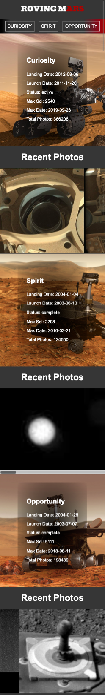

# Rovering Mars

## Project Setup

1. Install dependencies

```
yarn
```

2. Create `.env` file in project root folder

API_KEY=DEMO_KEY can be used to test the project

```
API_KEY=DEMO_KEY
```

3. Start the development server

```
yarn start
```

## Project Screenshots

### Mobile version



### Destop version


